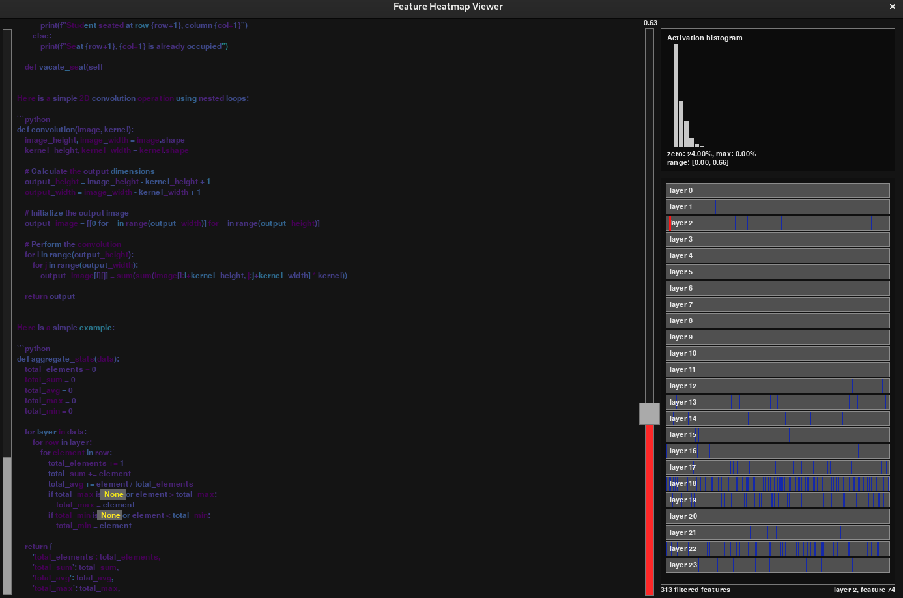
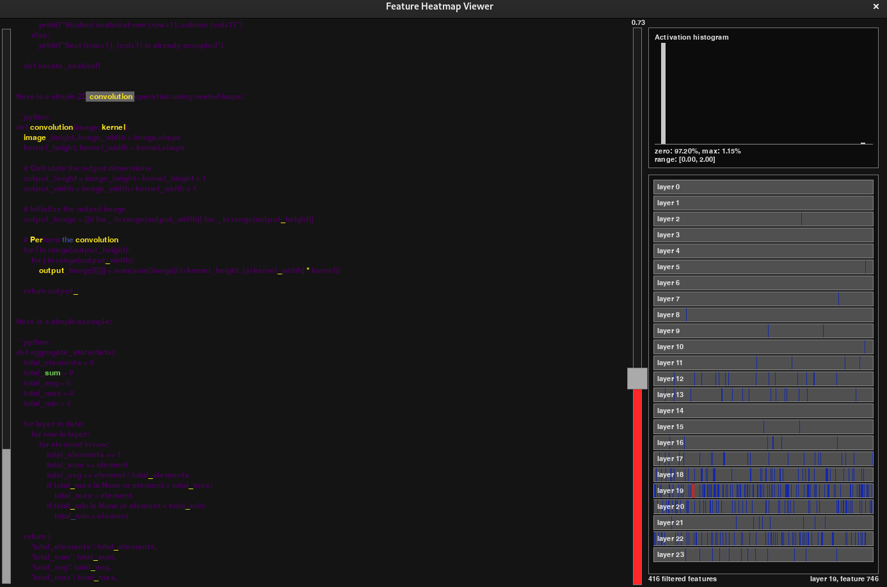

# llm_fine_tuning

## Purpose:

This pipeline demonstrates targeted feature recogniton on a lightweight 1.3B-parameter deepsseek code-generation model. It trains 24 linear sparse autoencoders (one for each transformer block output) on roughly 75 million tokens to uncover a large set of latent "feature flags" that correspond to recognizable coding practices. LLM inference is later run on a number of prompts generating 200 tokens each. Feature activations of the 4096 flags, for each of the 24 layers, for all tokens are recorded, are downsampled and saved as bytes, totaling 20 million total saved activations per prompt. A custom GUI is then used to display the inference generated code and comments, from all prompts. It features a colormapped text and click-to-select token feature filters, along with a slider filter for activation-threshold, to identify select features of interest.  

## Prerequisites:

**Base Model** - This pipeline utilizes the open-access, locally-executable deepseek-coder-1.3b-instruct model, primarily trained for code generation. It is lightweight enough to run inference in less than one second per token on most desktop platforms equipped with a GPU.
link to base model:
https://huggingface.co/deepseek-ai/deepseek-coder-1.3b-instruct

**Training Data** - The pipeline begins by training the linear sparse autoencoders on millions of tokens from python code samples, fed into the llm. The codebase used for the training can be accessed on github from the link below. Only the first folder, "file-000000000001.json.gz", was used for training.
https://huggingface.co/datasets/codeparrot/codeparrot-clean/tree/main

**Hardware** - A desktop/laptop platform is capable of running the full pipeline locally. This pipeline requires a minimum of 6GB VRAM and 16GB RAM, driven by the memory allocation methods in the code, more or less memory may be required with refactoring, affecting performance.

## LSAE Training:

1) "trainLSAE.py" is placed in a directory containing the deepseek model folder, the json codebase file named as "training_scripts.json", and a subfolder named "LSAE_models". The script is run to begin training the autoencoders. Every 10 training passes, their updated weights will be saved into the "LSAE_models" subfolder. The script may be stopped and started as needed, and will resume training from the last checkpoint automatically.

2) Each autoencoder has input/output diminsions of 2048 (the embedding dimension of the deepseek llm), with a hidden "feature" layer of 4096, for ~16M parameters for each prompt.

3) Token count is hard-limited to 4000 tokens per code sample, to stay within the 6GB of VRAM, and may be adjusted as needed if more memory is avalible. Many code samples are less than 4000 tokens, so the average token count per code sample will be somewhere betweeen 3000 and 4000. The attached pre-trained autoencoders were exposed to about 20k code samples (~75 million tokens), providing a ratio of ~5 samples per parameter, which was found to be sufficent for basic feature extraction.

*Figure 1 - LSAE Block Diagram* 

## Inference and Feature Extraction:

1) "compile_features.py" is placed in a directory containing the "LSAE_models" subfolder, and a text file "prompts.txt", which should contain a series of custom prompts for the deepseek model to run inference. The prompts should be formatted to request python code likely to include the desired features. Prompts are newline delimited.

2) Running the script will run inference on the deepseek model, generating 200 tokens per prompt. Inference is also run on each LSAE, for each token. The activation strengths of all 4096 features for each of the 24 autoencoders are downsampled, scaled to uint8, and saved to a NumPy array containing ~20M activations per prompt. The array is saved as "all_features_out.npy" upon completion.

3) The script will save generated tokens as "all_tokens_out.csv", which is indexed later in the search script. A plaintext version of all generated tokens is saved in "all_text_out.txt".

## Feature Evaluation:

1) "search_features.py" is placed in a directory containing the outputs of compile_features.py, the "all_tokens_out.csv" and "all_features_out.npy" files. The script runs a GUI which allows searching for desired features.

2) All outputs generated by the llm are shown in a general text format, and are scrollable using the up/down arrow keys or the left-hand scrollbar. Tokens (text) are shown in a colormap indicating the activation level for the selected feature.

3) All feature activations may be visualized by using the mousewheel to scroll. A key-token, or multiple, may be highlighted/unhighlighted by left clicking them. This will limit the scrollable features to those whose selected tokens fall above the activation threshold. Activation threshold can be set using the right-hand scrollbar. 

## Results:

The trained linear sparse autoencoders produced flags for many interpretable, semantically meaningful features across layers, aligned with recognizable lexical, structural, and algorithmic coding patterns. These features were stable across prompts and reproducible across inference runs.

Below are representative examples of emergent feature behavior observed using the interactive search GUI.

1) **Use of None** -This feature activates strongly on tokens corresponding to the Python keyword `None`. Activation is largely invariant to surrounding context and formatting, indicating that the feature has specialized on the semantic role of Python’s null value rather than its position in the syntax tree. Notably, the feature does not activate on similarly short literals (`0`, `False`, empty strings), suggesting that the LSAE has isolated `None` as a distinct semantic concept rather than a generic constant.

*Figure 2 - Use of "None"* 

2) **First Token of a Line Inside a Function or Class** -This feature activates strongly on the first non-whitespace token of indented lines within function or class bodies. It remains inactive on top-level code and on continuation lines (e.g., wrapped expressions or chained method calls). The behavior indicates that the feature is encoding structural position rather than token identity. The same token (`if`, `return`, variable names) produces different activations depending on whether it appears as the leading token of a block-scoped line. This suggests that positional and indentation-related information is preserved. 

*Figure 3 - First Token of a Line Inside a Function or Class* 

3) **Convolusions on Images, Kernals** -This feature activates strongly on code segments involving 2D convolutions, image kernels, and filter operations. Strong responses are observed for tokens associated with kernel definitions, convolution loops, sliding-window logic, and common variable names (`kernel`, `filter`, `stride`, `padding`, etc.). Activation spans multiple consecutive tokens and often peaks around loop headers or array-indexing expressions, indicating sensitivity to higher-level algorithmic structure rather than isolated keywords. The feature generalizes across different coding styles and libraries (NumPy-based implementations versus manual nested loops), suggesting abstraction beyond surface-level syntax.

*Figure 4 - Convolusions on Images, Kernals* 

**NOTES:**

-Features range from **lexical** (single-token concepts) to **structural** (indentation, block position) to **algorithmic** (multi-token patterns spanning lines).

-Later transformer layers tend to produce features that are more semantically coherent and less token-specific, while earlier layers emphasize syntactic and positional patterns.

-Many features exhibit sparse, near-binary behavior, validating the effectiveness of the sparsity constraint despite aggressive uint8 downsampling during recording.

-The interactive GUI proved essential for interpretation, allowing rapid hypothesis testing by clicking tokens, adjusting activation thresholds, and scanning across layers and features.

-Due to the use of fixed-range downsampling of feature activations (from 0-2), later layers tend to exhibit a larger number of feature activations for a given threshold. Methods of regularization will be explored in the future.

